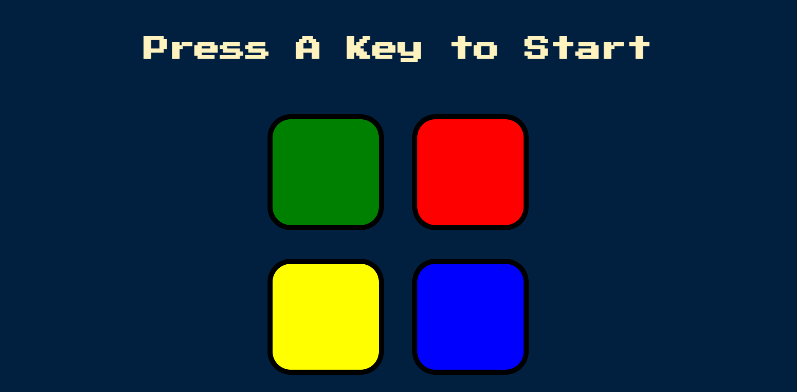

"Simon Game"
Creating the Simon Game using HTML, CSS, JS and jQuery

#What's the game about?
->It tests the retaining capacity and short term memory skills of the player as they've to replicate the colour pattern that the Simon game shows!

#STEPS FOR PLAYING THE GAME:
1. Press any key to begin.
2. The Simon blinks one of the colour keys. Remember what Simon has just flashed.
3. Now, press that colour key.
4. Simon gives you a new signal now if you pressed the right key.
5. Now, first press the key that Simon indicated initially followed by the next, and thus the process continues. Everytime you've to repeat the pattern, commencing from the very initial press and following the correct order.
6. So, your job is to retain the sequence in which the colours have to be pressed and replicate it, failing to which the game gets over and you can start all over again.
7. Have fun playing it!

Tech-Stack used: HTML , CSS , Javascript(Jquery framework)
